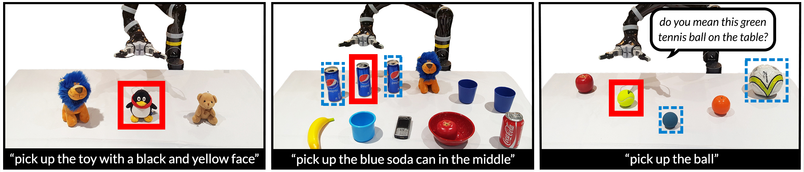
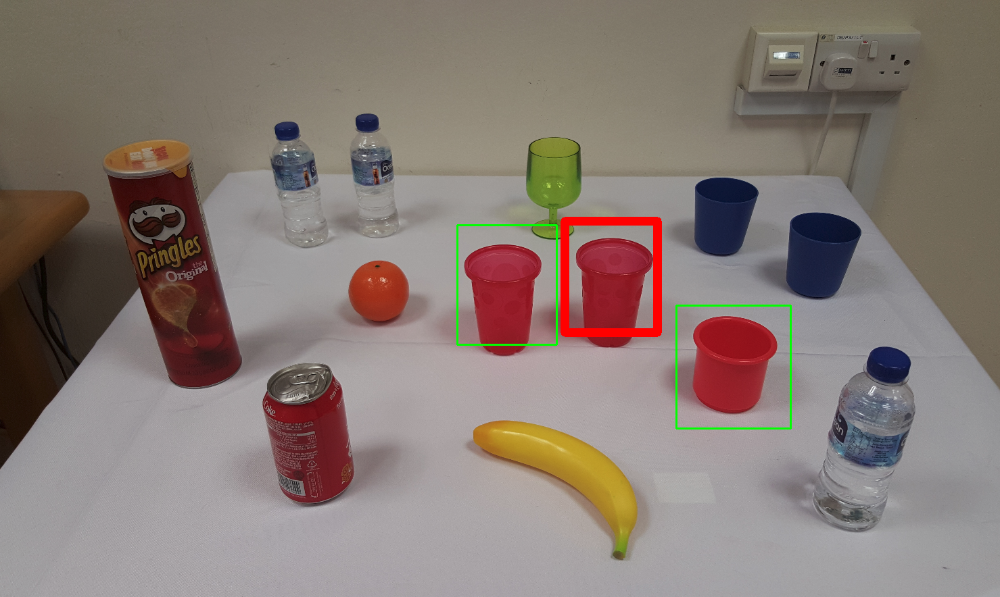

# INGRESS

[**Interactive Visual Grounding of Referring Expressions for Human Robot Interaction**](http://www.roboticsproceedings.org/rss14/p28.pdf)  
Mohit Shridhar, David Hsu  
RSS 2018



This is a docker image (~9.2GB) of my **demo setup** for grounding referring expressions. You can treat this is as a black box; input: image & expression, output: bounding boxes and question captions. See [Architecture](docs/arch.md) for more details.   

If you find the code useful, please cite:

```
@inproceedings{Shridhar-RSS-18, 
    author    = {Mohit Shridhar AND David Hsu}, 
    title     = {Interactive Visual Grounding of Referring Expressions for Human-Robot Interaction}, 
    booktitle = {Proceedings of Robotics: Science and Systems}, 
    year      = {2018}
} 
```

And works in the [acknowledgements](#acknowledgements).

## Requirements

### Software
- [Ubuntu 16.04](http://releases.ubuntu.com/16.04/)
- [Docker 18.03.1+](https://docs.docker.com/install/linux/docker-ce/ubuntu/#install-docker-ce)
- [NVIDIA Docker](https://github.com/NVIDIA/nvidia-docker)
- [ROS Kinetic](http://wiki.ros.org/kinetic/Installation/Ubuntu) 
- [OpenCV 2](https://docs.opencv.org/3.4.1/d2/de6/tutorial_py_setup_in_ubuntu.html) (Optional)

### Hardware
- Tested on NVIDIA GTX 1080 (needs about 2.5 GB RAM)

## Installation
The docker image contains: [ROS (kinetic)](http://wiki.ros.org/kinetic), [Torch](http://torch.ch/), [Caffe](http://caffe.berkeleyvision.org/), and Ingress (source code). To run and test Ingress inside the docker image, you don't need to install any dependencies other than nvidia-docker itself.

<!--However, for a server-client setup, you need to clone this repo on both the server & client, and compile the interface on the client side (see below). The client can also be the shell running the docker image.-->   

### Nvidia Docker 
Follow the instructions to [install NVIDIA docker](https://github.com/NVIDIA/nvidia-docker). You should be able to run this inside docker, if everything is installed properly:
```bash
$ nvidia-smi
```

### Download Docker Image
Clone the repo and build ROS workspace:
```bash
$ git clone https://github.com/AdaCompNUS/ingress.git
$ cd ingress/ingress_ros_ws
$ catkin_make
$ source devel/setup.bash
```

Run the script. The first time you run this command, Docker downloads an 9.2GB image (could take a while!):
```bash
$ cd <ingress_dir>
$ sh start_ingress.sh
```

Inside docker, install lua torch and cuda libraries:
```bash
$ luarocks install cutorch
$ luarocks install cunn
$ luarocks install cudnn
```

## Demo
In the demo, the ingress docker image is used as a grounding server and the host system acts as a client. 

### Configure Network 
Go **inside the docker**, edit the `~/ingress_server.sh` script with your network settings:
```bash
...
export ROS_MASTER_URI=http://<roscore_ip_addr>:11311
export ROS_IP=<ingress_system_ip_addr>
...
```

or manually set up the ROS_MASTER_URI
 ```
export ROS_MASTER_URI="http://<roscore_ip_addr>:11311"
export ROS_IP=<ingress_system_ip_addr>
```

### Run Demo
Start `roscore` on your **robot or client-pc.** 
```bash
root@pc:/# roscore
```

Then start `ingress` inside the **docker image:**
```bash
$ sh start_ingress.sh
root@docker-container:/# ingress
```
Wait until you see `METEOR initialized`. That means the grounding server is ready. Now you can send images and expressions to the server, and receive grounded bounding boxes and question captions as output.  

Now you can run the example on **robot or client-pc**

```bash
root@pc:/# cd <ingress-repo-root>/examples/
root@pc:/# python interactive_grounding_example.py
```

Type "the red cup" into the query. This outputs `grounding_result.png` and prints out self-referrential and relational question captions:



```
[INFO] [WallTime: 1532576914.160205] Self Referential Captions:
['a red cup on the table', 'red cup on the table', 'red cup on the table']

[INFO] [WallTime: 1532576914.160599] Relational Captions:
['the red cup in the middle.', 'the red cup on the left.', 'the red cup on the right.']
```

### Exit
**In docker**, to shutdown the `ingress` server, use `Ctrl + c` or `Ctrl + \`.

## How to make changes:

### Ingress client:
You can make changes and test ingress ROS client normally

### Ingress server and ROS interface:
The source code for ingress server is stored in <repo-root>/docker_root. You can make change there. However, when you want to test the change, you have to copy it into docker. If you make changes to ingress ros interfaces (such as ingress_msgs), you have to copy them into docker as well.
```bash
docker cp docker_root/. <container-id>:/root/
docker cp ingress_ros_ws <container-id>:/root/
```

## Options

### Disambiguation

By default, the disambiguation is enabled. It can disabled by setting `DISAMBIGUATE=false` in `~/ingress_server.sh` for fast-grounding without disambiguation **in docker**:

```bash
root@docker-container:/# sed -i 's/DISAMBIGUATE=true/DISAMBIGUATE=false/g' ~/ingress_server.sh
root@docker-container:/# ingress
```

## Tips

- Make sure the input image is well-lit, and the scene is uncluttered
- Crop the image to exclude irrelevant parts of the scene (e.g: backdrop of the table) to reduce mis-detections
- `roscore` should be up and running before you start the `ingress` server
- Use [tmux](http://manpages.ubuntu.com/manpages/xenial/man1/tmux.1.html) to multiplex `roscore`, `ingress` and `python interactive_grounding_example.py`

## Caveats

- This demo code doesn't contain the interactive (robot-pointing) question asking interface.
- For grounding perspectives (e.g: 'my left', 'your right') see [perspective correction guide](docs/persp.md).

## Issues

If Lua complains that certain CUDA functions were not found during execution, run the script and reinstall the rocks:

```bash
$ luarocks install cutorch
$ luarocks install cunn
$ luarocks install cudnn
```

Exit and `docker commit` the changes to the image.

## Acknowledgements

[Johnson et. al, Densecap](https://github.com/jcjohnson/densecap)  
```
@inproceedings{densecap,
  title={DenseCap: Fully Convolutional Localization Networks for Dense Captioning},
  author={Johnson, Justin and Karpathy, Andrej and Fei-Fei, Li},
  booktitle={Proceedings of the IEEE Conference on Computer Vision and 
             Pattern Recognition},
  year={2016}
}
```
  
[Nagaraja et. al, Referring Expressions](https://github.com/varun-nagaraja/referring-expressions)
```
@inproceedings{nagaraja16refexp,
  title={Modeling Context Between Objects for Referring Expression Understanding},
  author={Varun K. Nagaraja and Vlad I. Morariu and Larry S. Davis},
  booktitle={ECCV},
  year={2016}
}
```

